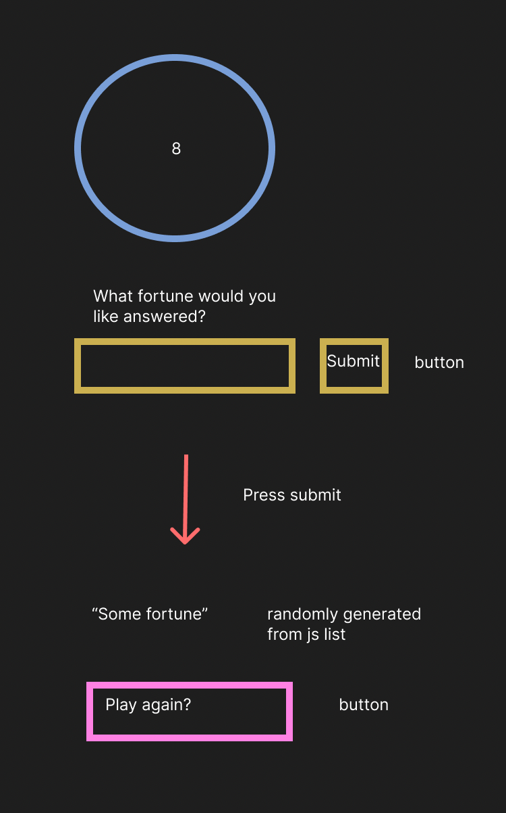

## HTML

-input area for users questions
-submit button (eventListener)
-8 ball (div)
-an answer to the users question (div)

## State Variable thats change over time

-   selectedFortune

## Events

-submit button 'clicks'
-8 ball image disappears and is replaced with the fortune
-button to play again

-play a gain button 'clicks'
-resets to show 8 ball and former fortune disappears

